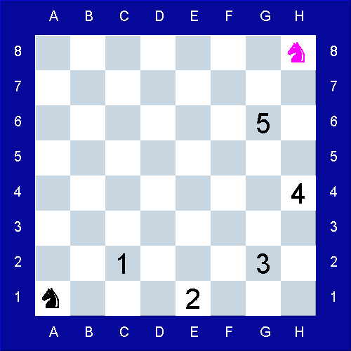

```
░█████╗░██╗░░██╗███████╗░██████╗░██████╗  ██╗░░██╗███╗░░██╗██╗░██████╗░██╗░░██╗████████╗    (\=,
██╔══██╗██║░░██║██╔════╝██╔════╝██╔════╝  ██║░██╔╝████╗░██║██║██╔════╝░██║░░██║╚══██╔══╝   //  .\
██║░░╚═╝███████║█████╗░░╚█████╗░╚█████╗░  █████═╝░██╔██╗██║██║██║░░██╗░███████║░░░██║░░░  (( \_  \
██║░░██╗██╔══██║██╔══╝░░░╚═══██╗░╚═══██╗  ██╔═██╗░██║╚████║██║██║░░╚██╗██╔══██║░░░██║░░░   ))  `\_)
╚█████╔╝██║░░██║███████╗██████╔╝██████╔╝  ██║░╚██╗██║░╚███║██║╚██████╔╝██║░░██║░░░██║░░░  (/     \
░╚════╝░╚═╝░░╚═╝╚══════╝╚═════╝░╚═════╝░  ╚═╝░░╚═╝╚═╝░░╚══╝╚═╝░╚═════╝░╚═╝░░╚═╝░░░╚═╝░░░  (_______)
```
# Постановка задачи

Имеется шахматная доска размером width на height. Width обозначает ширину доски по горизонтали. Height высоту доски по вертикали.
Даны начальное start и конечное end положение коня, например, B1 и A3. Латинскими буквами обозначается позиция на доске по горизонтали, цифрами позиция по вертикали, аналогично тому как это делается в Excel.
Подсчитать за какое минимальное количество ходов конь достигнет конечного положения. В случае, если конечное положение недостижимо возвратить «-1».

Требуется разработать веб-приложение, реализующее заданный алгоритм в виде REST сервиса.

Необходимо опубликовать два варианта REST endpoints:
- endpoint /horse/servlet/count в виде сервлета (Java Servlet)
- endpoint /horse/rest/count в виде Spring Controller (RestController)

Добавить endpoint с выводом шахматной доски картинкой в формате PNG:
- endpoint /horse/rest/image

Добавить endpoint с выводом координат клеток пути коня:
- endpoint /horse/rest/way

Входные данные передаются через параметры REST сервиса. Результат работы алгоритма печатается в теле Response.
Приложение должно работать на базе Tomcat c использованием SpringBoot framework.

- Для сборки проекта должна быть использована система сборки maven.
- Проект должен содержать JUnit тесты.
- Код приложения должен быть декомпозирован на несколько классов.
- Следует использовать JDK версии 8 и более.

## Пример
запрос вида:
http://localhost:8080/horse/rest/count?width=10&height=14&start=B1&end=A3
должен вернуть 1, так как клетка A3 достижима из положения B1 за один ход.

запрос вида:
http://localhost:8080/horse/rest/image?width=8&height=8&start=A1&end=H8
должен вернуть PNG-картинку с шахматной доской:



запрос вида:
http://localhost:8080/horse/rest/way?width=8&height=8&start=A1&end=H8
должен вернуть путь:

A1 -> C2 -> E1 -> G2 -> H4 -> G6 -> H8

## Требование к оформлению решения
Решение должно быть оформлено в git репозитории github.com
В Readme должна быть приложена инструкция по сборке.
Код должен быть читаем и хорошо декомпозирован. 

## Инструкция по сборке
Этот проект собирается используя Maven. Для запуска воспользуйтесь следующими командами:
```bash
git clone https://github.com/AlexMaxpower/chessknight.git
cd chessknight
mvn package spring-boot:run
```